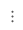
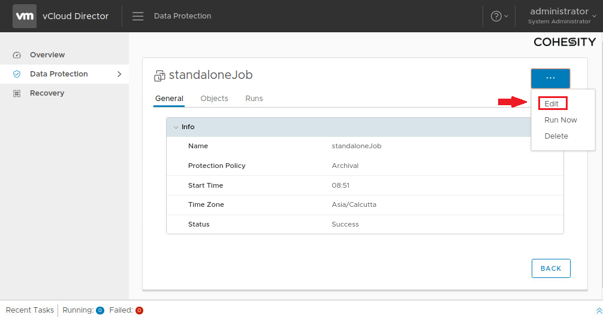
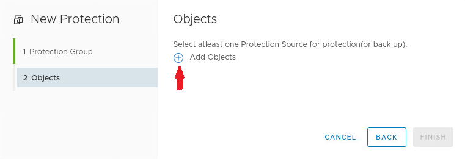
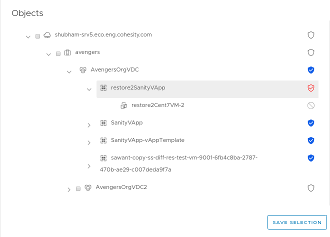

Protection group can be edited through VCD. 

**To edit protection group:**

1. Log into vCD as a tenant user.
2. Click  and navigate to **Data Protection**.
3. Click **Data Protection**.
4. Click **Protection Group**.
5. Click  of protection group to be edited
or
Select the protection group to be edited, which will show the information about the selected protection group. Click  button and select **Edit** option.

6. An edit form will be displayed.
7. Edit the field of protection group to be updated.
9. On click **Next**, it will navigate to object page where VMs can be selected for protection or removed from protection.
10. Click on , which will list out the available sources for protection.

11. Select the object need to be protected.
12. Select the protected object which need to be removed from protection.
13. Click on the source to auto protect the source or unprotect/exclude the source from auto protection(incase if it is auto protected already).

13. To select the source individually, click on the checkbox of the particular source.
14. After the protection source selection, click on the button **Save Selection**.
15. Click on **Finish** button.
16. Protection group will be updated successfully.

   **Note**: Protection group can be restricted per organization VDC by setting **Restrict Protection Group per Org VDC** flag as **Yes** in the **Settings** page of provider. so the protection group of specific organization VDC cannot be used for protecting source under different organization VDC.  