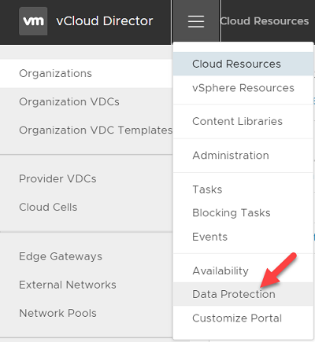

1. Login to Github and navigate to the [Release section](https://github.com/cohesity/cohesity-vcd-extension/releases) and download the **dataProtection.zip** file. 
2. Extract the contents of this zip to a directory called dataProtection and change directory to this directory. Run the following commands:
     
   `unzip dataProtection.zip`
     
   `cd dataProtection`
3. Enter the VCD details in **ui_ext_api.ini** file and make sure the user is VCD system administrator.
   Example:
     
   `vcduri=https://<vcd-fqdn>`
     
   `username=<system-user-id>`
     
   `organization=System`
     
   `password=<user-password>`
4. Run the following command below to deploy the plugin.
     
    `python deploy.py deploy` 
          
   To view the Cohesity extension, log in to VCD, click , the extension will be visible as **Data Protection**.
     
   