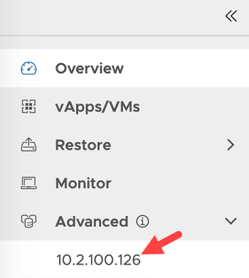

vCD tenant users can now launch Cohesity UI from the vCD extension and access advanced workflows that are not currently available in the vCD extension. This feature is disabled by default and service providers must enable it from the `Settings` section in the provider view.

## Prerequisite
- This feature is only supported with vCD extension v1.6.0+ and Cohesity cluster v6.5.1+
- The Gflag `allow_remote_login` must be set to `true` on the Cohesity cluster.
- To set the gflag, run the following command in the IRIS cli. For more details, click [here](https://github.com/cohesity/cohesity-vcd-extension/wiki/Planning-&-Preparation) 
`iris_cli cluster update-gflag gflag-name=allow_remote_login gflag-value=true service-name=iris reason="Enable vCD Cross Launch"`

## Enable Cross Launch Feature

1. Log in to VCD provider view with admin credentials.

2. Click , and select **Data Protection.** 
   The **Configuration** page displays. 

3. Click on **Settings** in the navigation panel.
   
4. Click **Edit**. 
   The **Edit settings modal** page displays.
   
5. Update the value of the **Cluster Access** field to enable/disable cross launch feature. By default, the value is set to **Disabled**.
     Update the value as **All Tenants**, to enable this feature for all your vCD tenants, or to **Custom** to enable it for selective tenants.
 
6. Click **Save**. 
 

## Access Cohesity GUI

1. Login to vCD as a tenant user

2. Click , and select **Data Protection.** 
   The **Dashboard** page displays.

3. In the navigation pane on the left, expand the **Advanced** option to see the Cohesity clusters with which the tenants have access to.

4. Click on any cluster to cross launch to the Cohesity cluster.
 
   