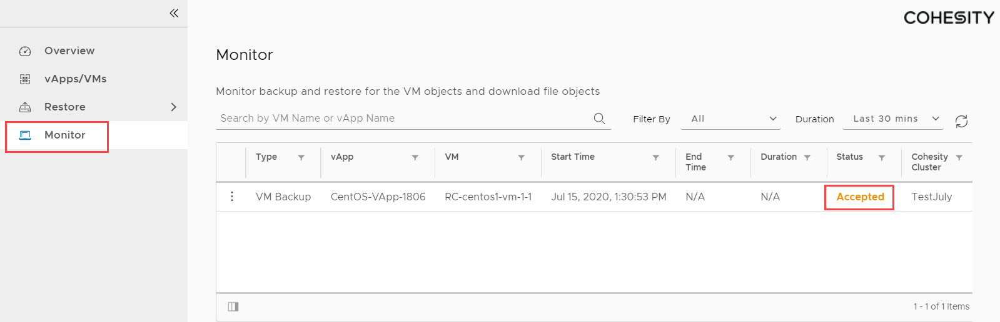
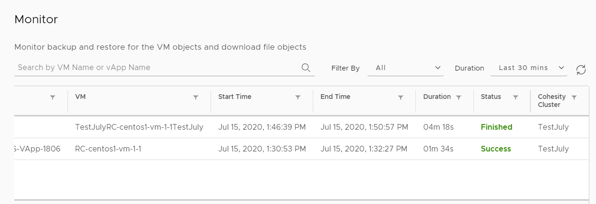

You can check the status of the backup and recovery tasks under the **Monitor** tab.  The following job status can be monitored through this page,
- Scheduled or on demand backup
- VM/vApp recovery
- File/Folder recovery
- File/Folder download

1. In the vCloud Director Tenant View, click  and navigate to **Data Protection** > **Monitor**. This will list all the tasks triggered over the last 7 days.

2. You can navigate to the **Status** column to verify the status of the recently triggered task.

3. If the Status is initially displayed as **Accepted** or **InProgress** as shown below, it signifies that the request is still in progress.
   

   After the backup or the restore task has successfully finished, the status is marked **Success** or **Finished**
   