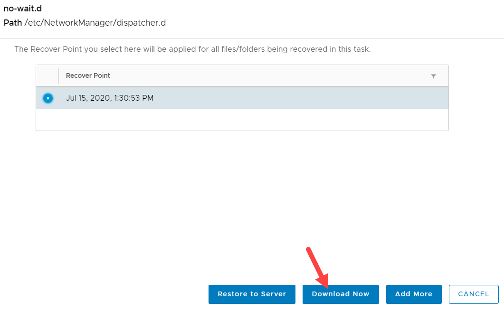

***To recover a file or folder:***

1. In the vCloud Director, click  and navigate to **Data Protection** > **Restore**.
2. Click **Files or Folders**.
3. Click **Files and Folders** option, search for a specific file, or a partial name, or use a wildcard expression such as * to search.
4. Select the file and click **Continue**.
5. From the list of snapshots, select the recovery point which will be applied to all the files or folders recovered in this task. 
6. Click **Restore to Server**.
7. Enter all the configuration details. 
8. Enter the user credentials for the VM and choose a snapshot. You can also choose to recover to a new location, in which case the recovery path should be mentioned. 
9. Click **Restore**.
   To check the status, navigate to **Monitor** to check for the recovery task as described in [Monitor Backup and Restore Tasks](https://github.com/cohesity/cohesity-vcd-extension/wiki/Monitor-Backup-and-Restore-Tasks).   

If you have chosen **Browse or Specify Path**, then enter the VM name to search, select the VM, click **Continue**. From the tree structure, browse and select the file that you want to recover, and click **Continue**. Fill in the configuration details and click **Restore**.   

   **Note**: You can also download files locally. Search for the file, click **Continue**, select the snapshot and click **Download Now.**  
To download the file, navigate to **Monitor,** select the job, right click and select **Show Details** and click **Download Files**.  
   